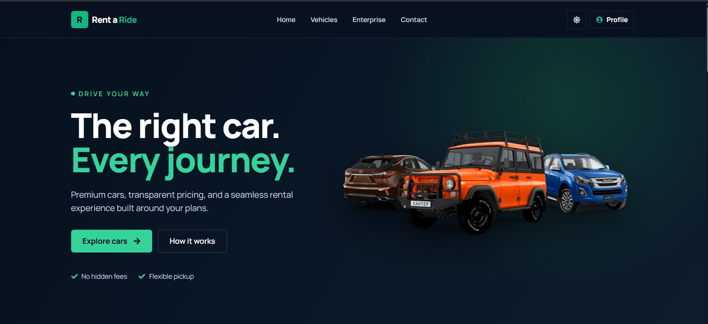
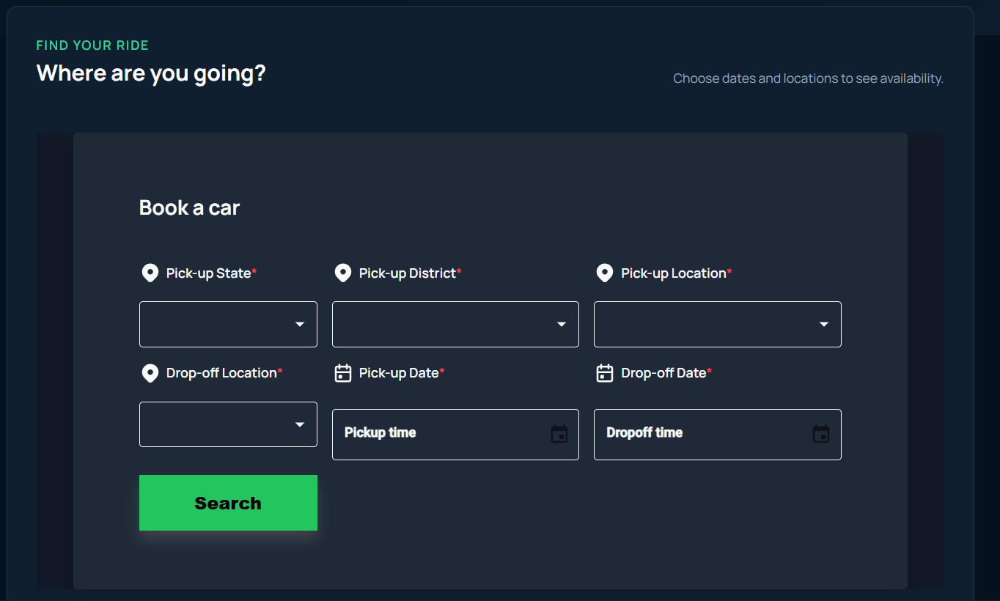
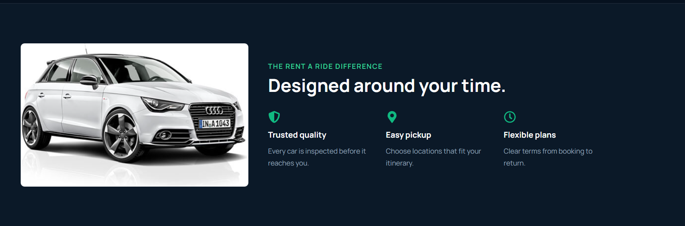

# Rent a Ride 🚗

A modern car rental website designed to help users explore vehicles and plan a rental with a clean, responsive interface. The project includes a vehicle-focused landing page, a booking search form, and sections highlighting the rental experience.

## Screenshots

### Home Page


### Booking Search


### Why Rent a Ride


## Features

- Modern dark-themed UI with green accent colors
- Landing page with vehicle showcase and calls to action
- Booking search form with pick-up state, district, location, drop-off location, and date/time fields
- Section highlighting trusted quality, easy pickup, and flexible plans
- Navigation links for Home, Vehicles, Enterprise, Contact, and Profile
- Responsive design goals for desktop and smaller screens

> Note: Describe only the features that are implemented in your current version. If a button or form is currently UI-only, mention that it is not connected to backend functionality yet.

## Tech Stack

Update this list to match the packages actually used in your repository.

- **Frontend:** React, JavaScript, HTML, CSS
- **Styling:** Add the styling framework/library used in your project (for example, Tailwind CSS)
- **Animations:** Add Framer Motion if it is used in this project
- **Backend:** Add your actual backend technology (for example, Node.js and Express)
- **Database:** Add your actual database, if configured

## Installation and Setup

### Prerequisites

- Node.js and npm installed
- Git installed

### 1. Clone the repository

```bash
git clone https://github.com/Shubhampandey00/rent-a-ride.git
cd rent-a-ride
```

### 2. Install dependencies

Check the project folders and install dependencies in the folder containing the relevant `package.json` file.

For a frontend inside `client`:

```bash
cd client
npm install
```

If the backend is in a separate `backend` folder, open a second terminal:

```bash
cd backend
npm install
```

### 3. Configure environment variables

Create a `.env` file in the appropriate folder(s) using the variable names required by your code. See the Environment Variables section below. Do not commit real credentials.

### 4. Run the project

Run the command defined by the `scripts` section of the relevant `package.json`. For a typical Vite React frontend, this is often:

```bash
npm run dev
```

For the backend, use the script configured in its `package.json` (often `npm run dev` or `npm start`).

## Environment Variables

The exact variables depend on your implementation. Use the names already referenced in your source code and replace these examples as needed.

Example frontend `.env`:

```env
VITE_API_BASE_URL=YOUR_BACKEND_API_URL
```

Example backend `.env` (only if your backend uses these variables):

```env
PORT=YOUR_SERVER_PORT
DATABASE_URL=YOUR_DATABASE_CONNECTION_STRING
JWT_SECRET=YOUR_JWT_SECRET
CLIENT_URL=YOUR_FRONTEND_URL
```

Never put real API keys, database passwords, JWT secrets, or production credentials in this README or in a public repository. Keep `.env` files out of Git using `.gitignore`.

## Future Improvements

- Connect the booking form to the backend and validate all required fields
- Display available cars based on selected location and dates
- Add user authentication and profile management
- Add booking history, cancellation, and status tracking
- Add vehicle details, filters, and sorting
- Improve mobile/tablet layouts and accessibility
- Add automated tests and deployment instructions

## Author

**Shubham Pandey**

- GitHub: [Shubhampandey00](https://github.com/Shubhampandey00)
- LinkedIn: [Shubham Pandey](https://www.linkedin.com/in/shubham-pandey-63a6b1286/)

---

If you find this project useful, feel free to explore the repository and share feedback.
